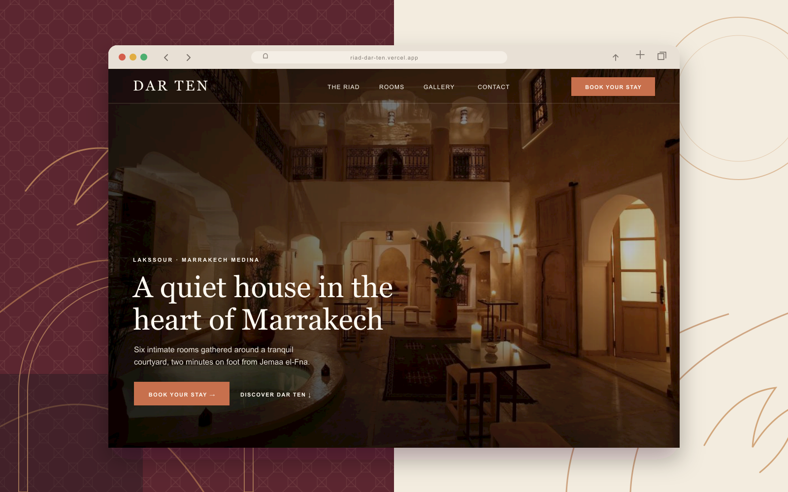

# Riad Dar Ten

> A quiet house in the heart of Marrakech.

Riad Dar Ten is an editorial boutique riad experience built around warm Moroccan hospitality, tranquil courtyards, and the intimate rhythm of a six-room guesthouse. The site pairs cinematic imagery with a calm, tactile interface that turns discovery into a direct booking request.

**Live site:** [riad-dar-ten.vercel.app](https://riad-dar-ten.vercel.app/)

<p align="center">
  
</p>

## The experience

- **Warm, editorial art direction** — terracotta accents, cream surfaces, midnight blue, and atmospheric Marrakech photography.
- **Story-led navigation** — the riad, rooms, gallery, contact, and booking pages unfold as one calm journey.
- **Booking-first flow** — clear calls to action keep a direct stay request close without interrupting the story.
- **Responsive by design** — the experience is composed to feel considered across desktop and mobile.

## Built with

Next.js 16 · React 19 · TypeScript · Tailwind CSS 4 · Motion · Font Awesome

## Routes

| Route | Purpose |
| --- | --- |
| `/` | Riad introduction, signature spaces, rooms, location, and booking CTA |
| `/riad` | Story, architecture, courtyard pool, rooftop, dining, and amenities |
| `/rooms` | Room overview, amenities, ideal stays, and room listings |
| `/rooms/[slug]` | Individual room details and booking CTA |
| `/gallery` | Curated photography of the riad and daily experience |
| `/book` | Direct booking request form and FAQ |
| `/contact` | Arrival details, location, and contact form |
| `/brand-identity` | Brand colors, typography, and visual direction |
| `/privacy` | Privacy policy |
| `/terms` | Terms of service |

## Run locally

```bash
npm install
npm run dev
```

Open [http://localhost:3000](http://localhost:3000) in your browser.

### Useful commands

```bash
npm run lint       # Check the codebase
npm run build      # Create a production build
npm run start      # Serve the production build
```

## Project structure

```text
app/         Pages, layouts, metadata, and global styles
components/  Shared navigation, booking, room, riad, and gallery sections
lib/         Shared room data and utilities
public/      Riad photography, preview assets, and static files
```

## Repository details

**Description**

> A cinematic Next.js website for Riad Dar Ten, a six-room boutique riad in Marrakech. Explore the rooms, courtyard, rooftop, and Moroccan hospitality through an immersive, booking-focused experience.

**Topics**

`nextjs, react, typescript, tailwindcss, vercel, boutique-hotel, riad, marrakech, morocco, travel-website, hospitality, web-design`

## Credits

Designed and built by **[Yassine Joundi](https://yassinejoundi.com/)**.

- [Twitter/X](https://x.com/mee_yassine)
- [LinkedIn](https://www.linkedin.com/in/yassine-joundi)
- [Email](mailto:joundiyassine@outlook.com)

© 2026 Riad Dar Ten
